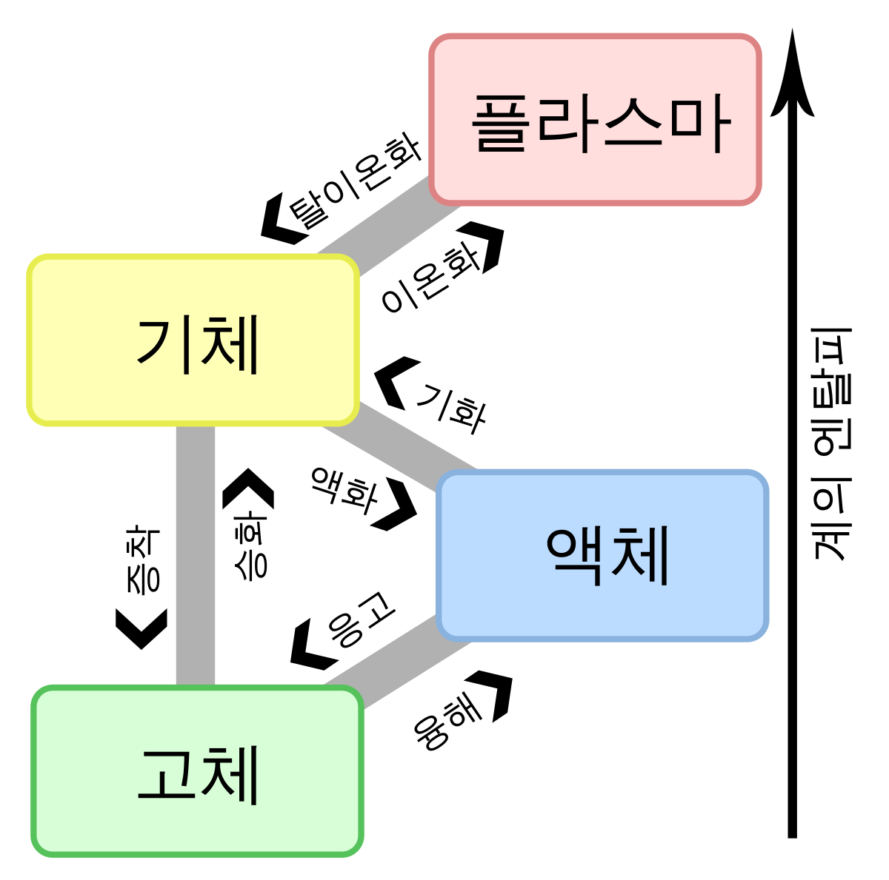

# 아이템 37. ordinal 인덱싱 대신 EnumMap을 사용하라

```kotlin
// 식물을 나타내는 간단한 클래스
data class Plant(
    val name: String,
    val lifeCycle: LifeCycle
) {
    enum class LifeCycle {
        ANNUAL, PERENNIAL, BIENNIAL
    }
}

// 심심해서 찾아본...
// ANNUAL → 한해살이 식물
// BIENNIAL → 두해살이 식물
// PERENNIAL → 여러해살이 식물 또는 다년생식물(多年生植物)
```

위와 같이 식물을 나타내는 클래스를 만들고, 정원을 돌면서 식물을 넣어준다.

```kotlin
val garden = arrayOf(
      Plant("바질", Plant.LifeCycle.ANNUAL),
      Plant("캐러웨이", Plant.LifeCycle.BIENNIAL),
      Plant("딜", Plant.LifeCycle.ANNUAL),
      Plant("라벤더", Plant.LifeCycle.PERENNIAL),
      Plant("파슬리", Plant.LifeCycle.BIENNIAL),
      Plant("로즈마리", Plant.LifeCycle.PERENNIAL)
  )
```

이제 집합들을 배열 하나에 넣고 생애주기의 ordinal 값을 그 배열의 인덱스로 넣으려고 한다면...

```kotlin
// 따라하지 말라는 코드입니다.
val plantsByLifeCycleArr = arrayOfNulls<MutableSet<*>>(Plant.LifeCycle.values().size) as Array<MutableSet<Plant>>
for (i in plantsByLifeCycleArr.indices) plantsByLifeCycleArr[i] = HashSet()
// ordinal 값을 배열의 인덱스로 넣어주는 부분
for (p in garden) plantsByLifeCycleArr[p.lifeCycle.ordinal].add(p)
// 결과 출력
println("코드 37-1 ordinal()을 배열 인덱스로 사용 - 따라 하지 말 것!")
for (i in plantsByLifeCycleArr.indices) {
    System.out.printf(
        "%s: %s%n",
        Plant.LifeCycle.values()[i], plantsByLifeCycleArr[i]
    )
}
```

👆위 방법의 문제점은?

- 배열은 제네릭과 호환이 되지 않으니 ([아이템28. 배열보다는 리스트를 사용하라](https://www.notion.so/28-12aee7cd123b45eb901872ede206fda1) )
  - 비검사 형변환을 수행해야하고
  - 깔끔히 컴파일이 안될 수 있다.
- 배열은 각 인덱스의 의미를 모르니, 출력 결과에 직접 레이블을 달아야 한다.
- 가장 심각한 문제는...?

  → 정확한 정숫값을 사용한다는 전제에 대한 증명이 필요하다.

  - 정수는 열거 타입과 달리 타입 안전하지 않기 때문에, 잘못된 값을 사용하면 잘못된 동작을 묵묵히 수행하거나, `ArrayIndexOutOfBoundsException` 을 던질 것이다.

그렇다면 이 문제를 멋지게 해결해주는 해결책은? → **열거 타입**을 **키로 사용**하는 `EnumMap`

```kotlin
val plantsByLifeCycle: MutableMap<Plant.LifeCycle, MutableSet<Plant>> = EnumMap(Plant.LifeCycle::class.java)
for (lc in Plant.LifeCycle.values()) plantsByLifeCycle[lc] = HashSet()
for (p in garden) plantsByLifeCycle[p.lifeCycle]!!.add(p)
println("코드 37-2 EnumMap을 사용해 데이터와 열거 타입을 매핑한다.")
println(plantsByLifeCycle)
```

위 방식의 장점!

- 더 짧고
- 더 명료하고
- 더 안전하고
- 성능도 원래 버전과 비등하고
- 안전하지 않은 형 변환은 사용 X
- 맵의 키인 열거 타입이 그 자체로 출력용 문자열을 제공해서 출력 결과에 직접 레이블 달 일 X
- 배열 인덱스를 계산하는 과정에서 오류가 날 가능성도 원천봉쇄

**EnumMap의 성능이 ordinal을 쓴 배열에 비견되는 이유는?**

→ 그 내부에서 배열을 사용하기 때문에

→ 내부 구현 방식을 안으로 숨겨서 Map의 타입 안전성과 배열의 성능을 모두 얻어낸 것

여기서 EnumMap의 생성자가 받는 키 타입의 Class 객체는 한정적 타입 토큰으로,

런타임 제네릭 타입 정보를 제공 ([아이템33. 타입 안전 이종 컨테이너를 고려하라](https://www.notion.so/33-b1fc432f7fe84f2f8406d8ce70b5c888) )

스트림을 사용해 맵을 관리하면 더 코드를 줄일 수 있다.

```kotlin
println(
    "코드 37-3 스트림을 사용한 코드 1 - EnumMap을 사용하지 않는다!"
)
println(
    Arrays.stream(garden)
        .collect(Collectors.groupingBy { p: Plant -> p.lifeCycle })
)
```

☝️이 코드는 EnumMap이 아닌 고유한 맵 구현체를 사용했기 때문에, EnumMap을 사용해서 얻은 공간과 성능 이점이 사라지는 문제가 존재

`Collectors.groupingBy` 메서드는 `mapFactory` 매개변수에 원하는 맵 구현체를 명시해 호출할 수 있기 때문에 아래과 같이 작성 가능하다. (맵을 빈번하게 사용하는 프로그램에서는 꼭 필요하겠지만... 굳이...)

```kotlin
println("코드 37-4 스트림을 사용한 코드 2 - EnumMap을 이용해 데이터와 열거 타입을 매핑했다.")
println(
    Arrays.stream(garden)
        .collect(
            Collectors.groupingBy(
                { p: Plant -> p.lifeCycle },
                { EnumMap(Plant.LifeCycle::class.java) }, Collectors.toSet()
            )
        )
)
```

스트림을 사용했을 때, EnumMap만 사용했을 때와 차이점은?

→ EnumMap 버전은 언제나 식물의 생애주기당 하나씩의 중첩 맵을 만든다.

→ 스트림 버전은 해당 생애주기에 속하는 식물이 있을 때만 만든다.

이제 두 열거 타입 값을 매핑하는 방법도 알아보자.

~~이번 예시는 중학교 과학시간부터 배우는 물질의 상태변화입니다~~



(그림이 겁나 크네요...)

먼저 안 좋은 예시 코드

```kotlin
public enum Phase {
	SOLID, LIQUID, GAS;

	public enum Transition {
		MELT, FREEZE, BOIL, CONDENSE, SUBLIME, DEPOSIT;

		// 행은 from의 ordinal을, 열은 to의 ordinal을 인덱스로 쓴다.
		private static final Transition[][] TRANSITIONS = {
			{ null, MELT, SUBLIME },
			{ FREEZE, null, BOIL },
			{ DEPOSIT, CONDENSE, null },
		};

		// 한 상태에서 다른 상태로의 전이를 반환한다.
		public static Transition from(Phase from, Phase to) {
			return TRANSITIONS[from.ordinal()][to.ordinal()];
		}
	}
}
```

(이건 코틀린으로 어찌해야할지 막막해서 고대로...)

위 방식은 행렬을 사용해서 멋져 보이지만, ordinal 과 배열 인덱스의 관계를 증명할 도리가 없다.

이걸 EnumMap 으로 사용하면...

```kotlin
enum class Phase {
    SOLID, LIQUID, GAS;
}

enum class Transition(
    val from: Phase, val to: Phase
) {
    MELT(Phase.SOLID, Phase.LIQUID),
    FREEZE(Phase.LIQUID, Phase.SOLID),
    BOIL(Phase.LIQUID, Phase.GAS),
    CONDENSE(Phase.GAS, Phase.LIQUID),
    SUBLIME(Phase.SOLID, Phase.GAS),
    DEPOSIT(Phase.GAS, Phase.SOLID);

    companion object {
        private val m: EnumMap<Phase, MutableMap<Phase, Transition>> = Arrays.stream(values())
            .collect(
                Collectors.groupingBy(
                    { t : Transition -> t.from },
                    { EnumMap(Phase::class.java) },
                    Collectors.toMap(
                        { t -> t.to },
                        { t -> t },
                    )
                )
            )

        fun from(from: Phase, to: Phase): Transition? {
            return m[from]?.get(to)
        }
    }
}
```

상전이 맵을 초기화 하는 코드는 제법 복잡하다

이 맵의 타입인 `EnumMap<Phase, MutableMap<Phase, Transition>>` 의 의미는

이전 상태에서 "이후상태에서 전이로의 맵"에 대응시키는 맵... ~~말도 어렵다~~

출력 값을 보면 조금 쉽다.

```kotlin
fun main() {
    for (src in Phase.values()) {
        for (dst in Phase.values()) {
            val transition = Transition.from(src, dst)
            if (transition != null) System.out.printf("%s에서 %s로 : %s %n", src, dst, transition)
        }
    }
}

// SOLID에서 LIQUID로 : MELT
// SOLID에서 GAS로 : SUBLIME
// LIQUID에서 SOLID로 : FREEZE
// LIQUID에서 GAS로 : BOIL
// GAS에서 SOLID로 : DEPOSIT
// GAS에서 LIQUID로 : CONDENSE
```

그냥 상태 전이하는 것에 대해 두 열거타입을 매핑한 것이다.

이제 여기서 새로운 상태 (열거 타입)을 추가하면, 이전의 행렬방식은 row, col 에 각각 추가를 해줘야 하지만,

이 코드에서는 Phase에 타입을 추가하고, Transition에 변화 양상을 넣어주면 된다.

```kotlin
enum class Phase {
    SOLID, LIQUID, GAS, PLASMA;
}

enum class Transition(
    val from: Phase, val to: Phase
) {
    MELT(Phase.SOLID, Phase.LIQUID),
    FREEZE(Phase.LIQUID, Phase.SOLID),
    BOIL(Phase.LIQUID, Phase.GAS),
    CONDENSE(Phase.GAS, Phase.LIQUID),
    SUBLIME(Phase.SOLID, Phase.GAS),
    DEPOSIT(Phase.GAS, Phase.SOLID),
    IONIZE(Phase.GAS, Phase.PLASMA),
    DEIONIZE(Phase.PLASMA, Phase.GAS);

		...
```

결과도 쉽게 출력된다.

```kotlin
SOLID에서 LIQUID로 : MELT
SOLID에서 GAS로 : SUBLIME
LIQUID에서 SOLID로 : FREEZE
LIQUID에서 GAS로 : BOIL
GAS에서 SOLID로 : DEPOSIT
GAS에서 LIQUID로 : CONDENSE
GAS에서 PLASMA로 : IONIZE
PLASMA에서 GAS로 : DEIONIZE
```

기존 로직에서 잘 처리해주니... 잘못 수정할 가능성이 극히 적다.

실제 내부에서도 맵들의 맵이 배열들의 배열로 구현되니

낭비되는 공간과 시간도 거의 없이 명확하고 안전하고 유지보수하기 좋다.

> 핵심 정리
>
> 배열의 인덱스를 얻기위해 ordinal 을 쓰는 것은 일반적으로 좋지 않으니,
> 대신 EnumMap을 사용하라!
> (EnumMap<..., EnumMap<...>> 으로 표현하자.
